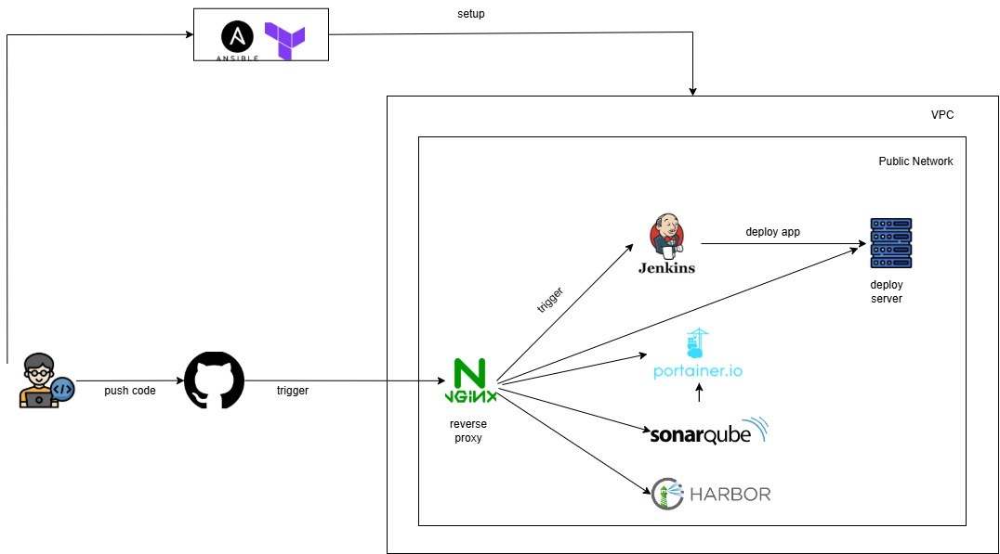
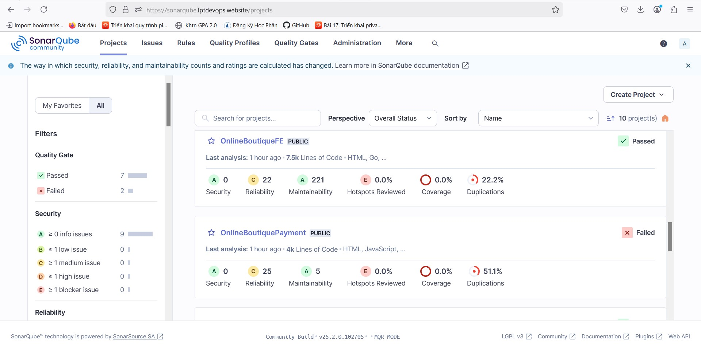
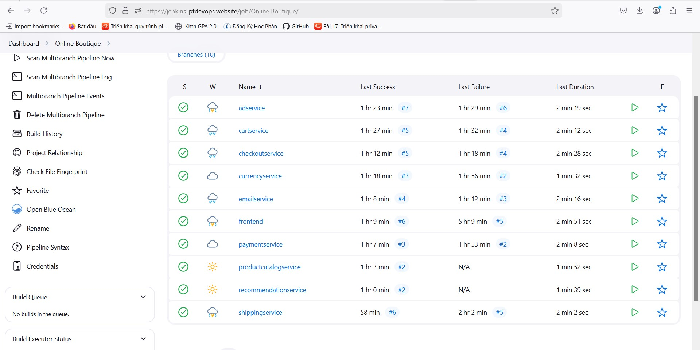
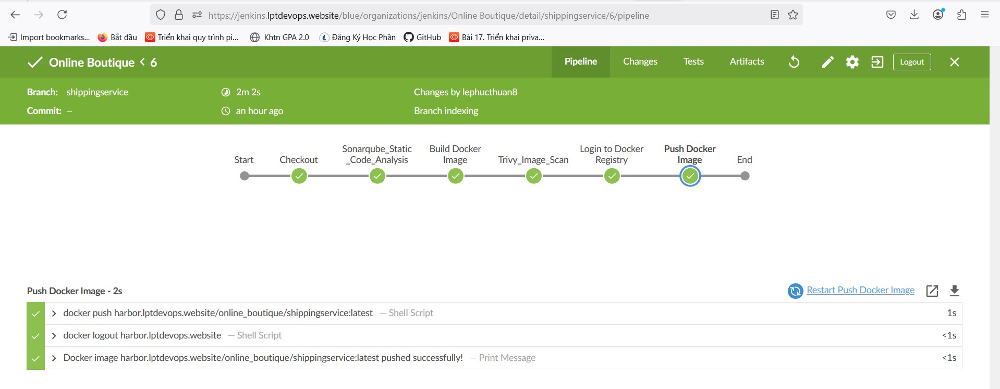
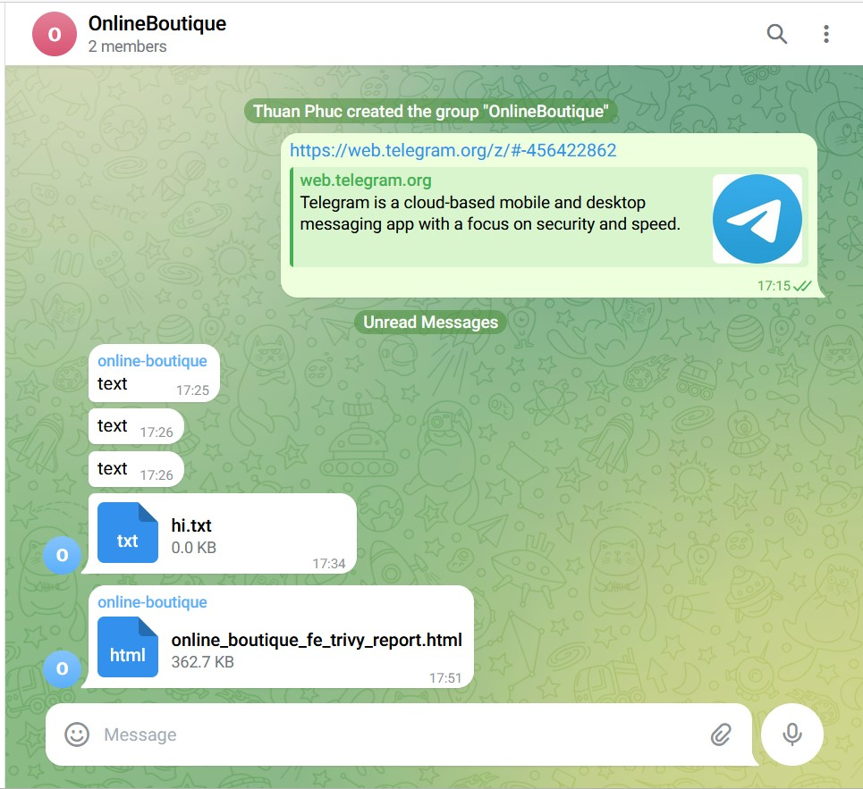
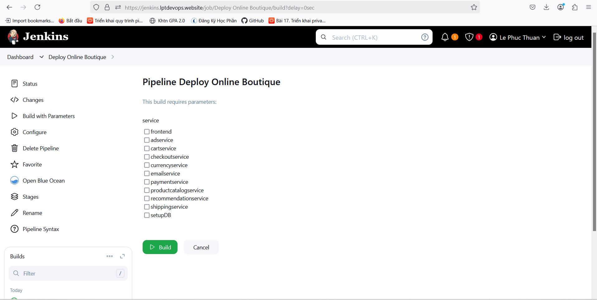
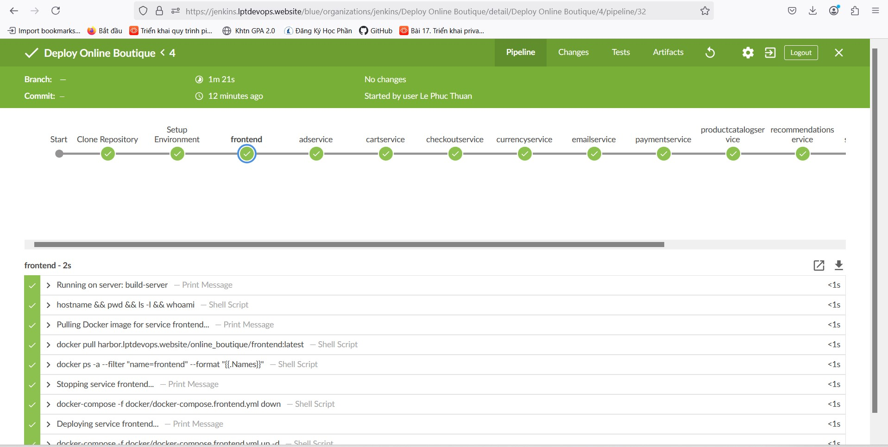
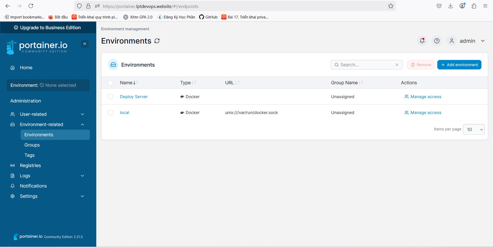
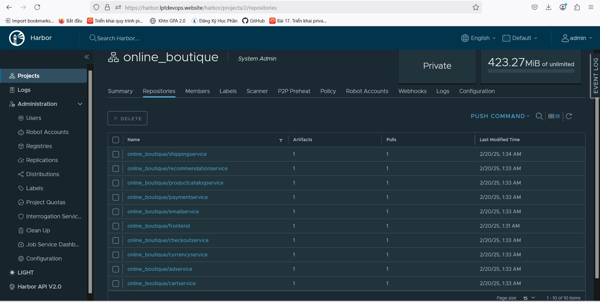
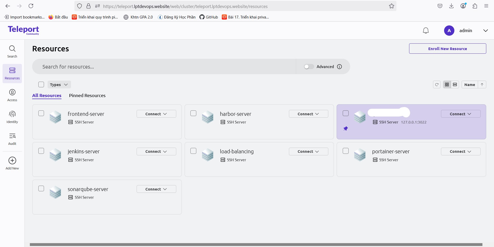

# Infrastructure Automation with Terraform and Ansible

## Overview

This project automates the deployment of virtual machines (VMs) for essential DevOps tools using **Terraform** and **Ansible**. The following services are provisioned:

- **SonarQube**: Code quality and security analysis
- **Jenkins**: Continuous Integration and Continuous Deployment (CI/CD)
- **Portainer**: Container management UI for Docker 
- **Harbor**: Container registry with security and vulnerability scanning
- **Teleport**: Central management for VMs and cloud infrastructure
- **Nginx**: Reverse proxy for all services
  
This solution provides a scalable, repeatable, and automated way to set up the DevOps infrastructure. By leveraging **Terraform** for provisioning and **Ansible** for configuration, this project simplifies the process of deploying and managing these essential tools.

---

## Prerequisites

To use this setup, ensure the following tools are installed and configured:

- **Terraform**: Used for provisioning cloud GCP.
- **Ansible**: Used for configuring services and VMs.

**Terraform** automates the provisioning of the following infrastructure components:

- **Virtual Machines (VMs)**: For deploying SonarQube, Jenkins, Portainer, and Harbor.
- **Networking**: Creation of VPCs, subnets, and security groups.

---

## Architecture Overview

#### Architecture Diagram

The following diagram illustrates the architecture of the infrastructure:

### Service Configuration with Ansible

Once the infrastructure is provisioned by Terraform, **Ansible** is used to configure and deploy the necessary services on each VM:

- **SonarQube**
- **Jenkins**
- **Portainer**
- **Harbor**
- **lOAD**
  

### Detailed Descriptions of Services
**SonarQube**: For code quality and security analysis.

**Jenkins**: To automate continuous integration and deployment pipelines.
- CI Pipeline with multibranch

Send report to telegram: 

- CD with choice-box

- **Portainer**: A web-based container management UI.

- **Harbor**: A cloud-native registry to manage container images with added security features.

- **Teleport**: A cloud-native registry to manage container images with added security features.

